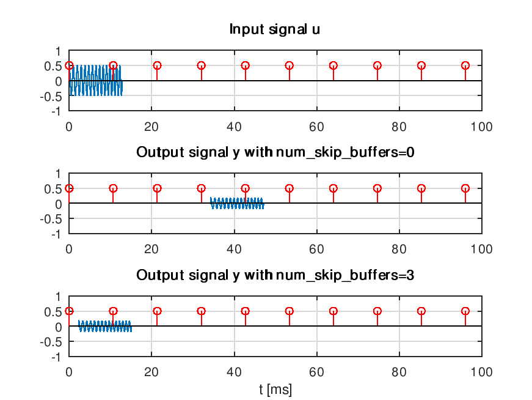

# Introduction

**jack-audio** provides functions to play, record, and (duplex) play/record audio data using the
JACK Audio Connection Kit (or JACK) for GNU Octave.

https://jackaudio.org

The code has been tested on the **Jackdmp JACK implementation for multi-processor machine**
version, also known as JACK2, on Linux.

# Prerequisites

Install a compiler tool chain, Octave development tools/libs, JACK2, and cmake.

Ubuntu:

```
$ sudo apt install liboctave-dev
$ sudo apt install build-essentials
$ sudo apt install libkack-jackd2-dev
$ sudo apt install cmake
```

Gentoo Linux:

Add `sci-mathematics/octave` to a file in `/etc/portage/package.accept_keywords/`
(recommended to get a more resent Octave version):

```
$ sudo emerge sci-mathematics/octave
$ sudo emerge media-sound/jack2
```

Build tools is installed by default on Gentoo Linux.

## Real-time Settings

Edit your `/etc/security/limits.conf` file to give audio a high real-time priority. Typically add something
like:

```
-snip-

@audio          -       rtprio          99
@audio          -       memlock         unlimited

# End of file
```

and make sure your user is a part of the `audio` group (a reboot may be needed). If this is not set you can
get an error similar to:
```
Cannot use real-time scheduling (RR/5) (1: Operation not permitted)
JackClient::AcquireSelfRealTime error
```

## Recommended JACK Tools

* QjackCtl: https://qjackctl.sourceforge.io/
* jaaa: http://kokkinizita.linuxaudio.org/linuxaudio/
* meterbridge: http://plugin.org.uk/meterbridge/

Ubuntu:
```
$ sudo apt install qjackctl
$ sudo apt install jaaa
$ sudo apt install meterbridge
```

Gentoo:
```
$ sudo emerge media-sound/qjackctl
$ sudo emerge media-sound/jaaa
$ sudo emerge media-sound/meterbridge
```

# Usage


Get information from the JACK audio server:

```
> [Fs_hz, jack_bufsize] = jinfo();
|------------------------------------------------------
|
| JACK engine sample rate: 48000 [Hz]
|
| JACK engine buffer size: 512 [frames]
|
| Current JACK engine CPU load: 2.111 [%]
|
|------------------------------------------------------
|         Input ports:
|------------------------------------------------------
|        system:playback_1 [physical]
|        system:playback_2 [physical]
|        system:playback_3 [physical]
|        system:playback_4 [physical]
|        system:playback_5 [physical]
|        system:playback_6 [physical]
|        system:playback_7 [physical]
|        system:playback_8 [physical]
|        system:playback_9 [physical]
|        system:playback_10 [physical]
|        system:playback_11 [physical]
|        system:playback_12 [physical]
|        system:playback_13 [physical]
|        system:playback_14 [physical]
|        system:playback_15 [physical]
|        system:playback_16 [physical]
|        system:playback_17 [physical]
|        system:playback_18 [physical]
|------------------------------------------------------
|         Output ports:
|------------------------------------------------------
|        system:capture_1 [physical]
|        system:capture_2 [physical]
|        system:capture_3 [physical]
|        system:capture_4 [physical]
|        system:capture_5 [physical]
|        system:capture_6 [physical]
|        system:capture_7 [physical]
|        system:capture_8 [physical]
|        system:capture_9 [physical]
|        system:capture_10 [physical]
|        system:capture_11 [physical]
|        system:capture_12 [physical]
|        system:capture_13 [physical]
|        system:capture_14 [physical]
|        system:capture_15 [physical]
|        system:capture_16 [physical]
|        system:capture_17 [physical]
|        system:capture_18 [physical]
|------------------------------------------------------
```

Gererate 5 seconds of (white noise) stereo input signal and play it:

```
> U = single(0.5*rand(5*Fs_hz, 2)-0.25);
> jplay(U,['system:playback_1'; 'system:playback_2']);
```

Record 5 seconds of stereo data:

```
> num_frames = 5*Fs_hz;
> Y = jrecord(num_frames,['system:capture_1'; 'system:capture_2']);
```

Play and record 5 secons of audio data:

```
> U = single(0.5*rand(5*Fs_hz, 2)-0.25);
> Y = jplayrec(U, ['system:capture_1'; 'system:capture_2'], ['system:playback_1'; 'system:playback_2']);
```

The output `Y` is normally delayed a few JACK buffer lengths relative to the input `U`.  `jplayrec`
has a 4:th optional argument where one can choose to skip recording a given number of buffer periods,
like, for example:

```
> num_skip_buffers = 3;
> Y = jplayrec(U, ['system:capture_1'], ['system:playback_1'],num_skip_buffers);
```

This is illustrated in the Figure 1. below where we have used a sine-burst as input signal
and connected the output directly to the input on the soundcard and plotted output data
with both `num_skip_buffers = 0` and `num_skip_buffers = 3` [the red bars in the plots
shows the JACK period (buffer) lengths].

<p align="center">

</p>

_Figure 1. Plots of input data, u, (upper plot) and output data, y, with `num_skip_buffers = 0`
(middle plot) and `num_skip_buffers = 3`(lower plot), respectively._

# Building

1. Clone the repository
2. Create a build folder and configure the build:

```
$ cd jack-audio
$ mkdir build && cd build
$ cmake -DCMAKE_CXX_FLAGS="-02 -Wall" ..
```

3. Build it

```
$ make -j4
```

4. Add the build folder to you Octave path.

```
$ addpath('<YOUR_JACK-AUDIO_FOLDER>/build/oct');
```
